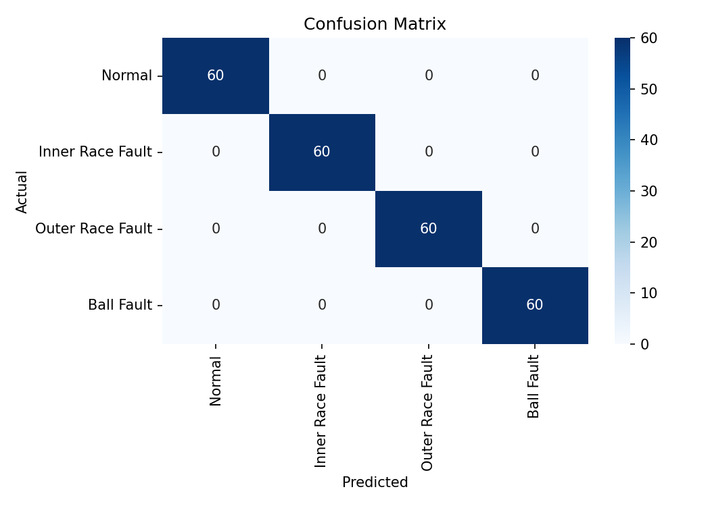
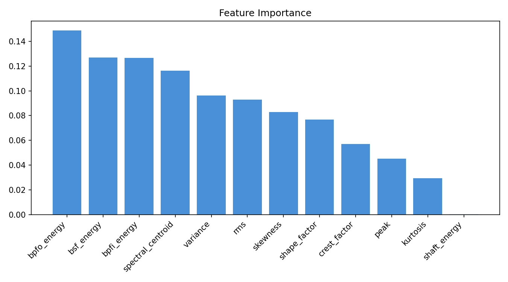

# Bearing Fault Detection — Predictive Maintenance

A machine learning system that detects bearing faults from vibration sensor data. Classifies equipment condition into four states using time and frequency domain feature extraction with a Random Forest classifier.

Tested at **100% accuracy** on simulated bearing data modeled after a 6205 deep groove ball bearing running at 1750 RPM.

---

## Demo

<table>
<tr>
<td></td>
<td></td>
</tr>
<tr>
<td align="center">Confusion Matrix</td>
<td align="center">Feature Importance</td>
</tr>
</table>

---

## Fault Classes

| Class | Fault Frequency | Physical Cause |
|---|---|---|
| Normal | — | Healthy bearing |
| Inner Race Fault | BPFI = 5.42 × shaft freq | Crack/spalling on inner ring |
| Outer Race Fault | BPFO = 3.58 × shaft freq | Crack/spalling on outer ring |
| Ball Fault | BSF = 2.36 × shaft freq | Damaged rolling element |

Fault frequencies are derived from real bearing geometry, not arbitrary values.

---

## Pipeline

```
Accelerometer on bearing housing (ADXL345 / MPU6050)
              ↓
    Raw vibration signal @ 12 kHz
              ↓
      Feature Extraction
      ├── Time domain  : RMS, Peak, Crest Factor, Kurtosis, Skewness
      └── Freq domain  : FFT energy at BPFI, BPFO, BSF, shaft frequency
              ↓
    Random Forest Classifier (100 trees)
              ↓
    Fault diagnosis + confidence scores + maintenance advice
```

---

## Results

| Metric | Score |
|---|---|
| Test Accuracy | 100% |
| 5-Fold CV Accuracy | 100% ± 0% |
| Training Samples | 960 |
| Test Samples | 240 |

---

## Features Used

**Time Domain**
- RMS — overall vibration energy, the most used metric in industry
- Crest Factor — peak/RMS ratio, sensitive to impulsive faults
- Kurtosis — statistical impulsiveness, highly sensitive to early-stage bearing faults
- Skewness, Variance, Shape Factor, Peak

**Frequency Domain**
- FFT energy in ±10 Hz bands around BPFI, BPFO, BSF, and shaft frequency
- Spectral centroid

---

## Setup

```bash
git clone https://github.com/YOUR_USERNAME/predictive-maintenance
cd predictive-maintenance

pip install -r requirements.txt

# Step 1 — Generate dataset
python generate_data.py

# Step 2 — Train model + generate plots
python train.py

# Step 3 — Launch demo
streamlit run app.py
```

---

## Project Structure

```
predictive-maintenance/
├── generate_data.py   # Signal simulation + feature extraction
├── train.py           # Model training, evaluation, plots
├── app.py             # Streamlit demo UI
├── requirements.txt
├── data/              # Generated dataset (gitignored)
└── outputs/           # Model + plots (gitignored)
```

---

## Embedded Systems Context

In production deployment:

- **Sensor** — ADXL345 or MPU6050 accelerometer over I2C/SPI
- **MCU** — STM32F446RE sampling at 10–50 kHz via ADC with DMA
- **Edge inference** — model converted to C arrays using [emlearn](https://github.com/emlearn/emlearn) or TensorFlow Lite for Microcontrollers
- **Alert** — fault condition transmitted over UART/BLE to a maintenance dashboard

This project covers the ML pipeline. The embedded acquisition layer is the natural extension.